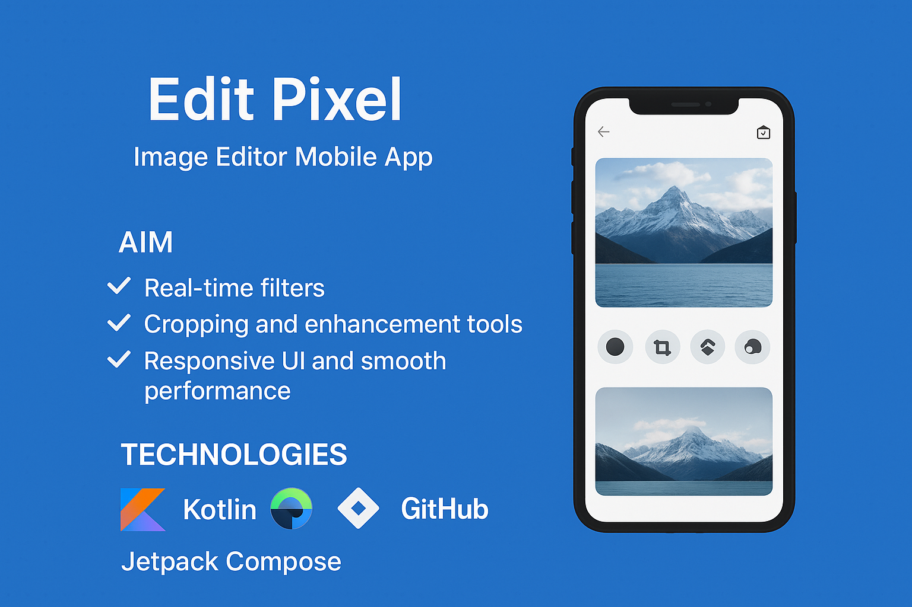

# 📱 Edit Pixel - Image Editor App

**Edit Pixel** is a mobile image editor application built with **Kotlin** and **Jetpack Compose**, designed for a smooth and intuitive photo editing experience.  
The app provides real-time editing features with a **responsive UI**, ensuring both performance and usability.  

---
## 📸 Project Preview

---

## ✨ Features
- 🎨 **Real-Time Filters** – Apply live filters to preview edits instantly.  
- ✂️ **Cropping Tools** – Resize and adjust images with precision.  
- 🔧 **Enhancement Tools** – Adjust brightness, contrast, and sharpness.  
- ⚡ **Smooth Performance** – Optimized with Jetpack Compose for fluid interactions.  
- 📱 **Responsive UI** – Adaptive design for various screen sizes.  

---

## 🛠️ Technologies
- **Kotlin** ☕  
- **Jetpack Compose** 🧩  
- **Jira** 📋 (Agile project management)  
- **GitHub** 🐙 (Version control & collaboration)  
- **Figma** 🎨 (UI/UX design)  

---
### Prerequisites
- Android Studio (latest version)  
- Kotlin SDK  
- Android device/emulator

### 📊 Results

- Smooth and responsive mobile editing experience.

- Enhanced productivity with real-time preview filters.

- User-friendly interface designed for accessibility.

- 
